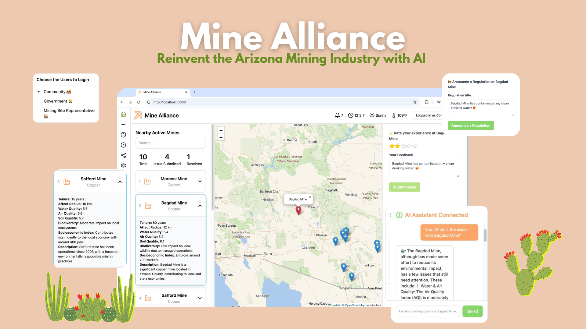

# Mine Alliance - Reinventing a sustainable future for Arizona Mining Industry with AI 🚀

An innovative, AI-driven application designed to unite stakeholders across Arizona's mining industry, promoting responsible and sustainable practices.

<!-- Live Demo: [Mine Alliance](http://54.245.158.146:3000/) -->

## Inspiration ✨

Once we learned that the majority of mining sites were on Indigenous land, some of it sacred land, and that the local communities had no power to raise objections or even to aquire information on the mines affecting their area. We felt motivated to give local communities the power of free information and a voice that was on equal footing with major mining companies and state and federal regulators, so that they could be a part in the process of mining minerals that are essential to human society.

## What it does ⛏️

Our website allows the three major stakeholders to log-in either as a community member, mining site representative, or government regulator. Where then, the individual can see information on nearby active mines including tenure; effect radius of the mine; water, soil, and air quality; biodiversity impact; socioeconomic impact; and a description of the mine. Depending on who's logged-in different options will be available. Community members can submit issues that they find with specific mining sites, whether it is an ecological issue or a disruption to sacred lands. Government regulators can submit new site specific regulations, giving a title to the new regulation and a description of the regulation. Mining site representatives can respond to feedback given on their mining sites and submit announcements that can be seen by everyone.

## How we build it 👷

### Front-end

- `NextJS` for SEO optimization and server-side rendering
- `TailwindCSS` for utility-first styling
- `Shadcn` for modern UI components and design system
- `Framermotion` for smooth, modern website animations
- `Leaflet` for interactive map and geospatial visualizations
- `Vercel` for seamless deployment and front-end hosting

### Back-end & DevOps

- `Flask` for handling HTTP requests and API development
- `SQLAlchemy` for robust database management and ORM
- `AWS EC2` for scalable and flexible cloud computing infrastructure
- `Amazon SageMaker` for builidng, training, and deploying geologically intelligent model
- `ChatGPT-4` API intergration for advanced NLP

## Challenges we ran into 🚒

Enter text here

## Accomplishments that we're proud of 👍

We spent a lot of time researching what specific information to show that would be relevant for our stakeholders and what goes into creating an impact assessment.

## What we learned 📕

Enter text here

## What's Next 🚀

Enter text here
