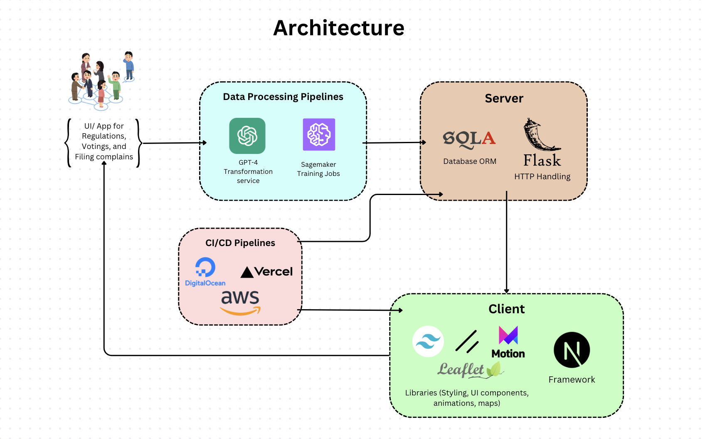

# Mine Alliance - Reinventing a sustainable future for Arizona Mining Industry with AI 🚀

As an innovative, AI-driven application designed to unite stakeholders across Arizona's mining industry, promoting responsible and sustainable practices. This platform would leverage artificial intelligence to facilitate collaboration between mining companies, local communities, environmental groups, and government agencies.

Live Demo: [Mine Alliance](http://54.245.158.146:3000/)

## Inspiration ✨

Once we saw the data showing that the majority of mining sites are on Indigenous land, some of it sacred land, and that the local communities had no power to raise objections or even aquire information on the mines affecting their area. We felt motivated to give local communities the power of free information and a voice that was on equal footing with major mining companies and state and federal regulators, so that they could be a part in the process of mining minerals that are essential to human society.

## What it does ⛏️

Enter text here

## How we build it 👷

### Front-end
- `NextJS` for SEO optimization and server-side rendering
- `TailwindCSS` for utility-first styling
- `Shadcn` for modern UI components and design system
- `Framermotion` for smooth, modern website animations
- `Leaflet` for interactive map and geospatial visualizations
- `Vercel` for seamless deployment and front-end hosting

### Back-end & DevOps
- `Flask` for handling HTTP requests and API development
- `SQLAlchemy` for robust database management and ORM
- `AWS EC2` for scalable and flexible cloud computing infrastructure
- `Amazon SageMaker` for builidng, training, and deploying geologically intelligent model
- `ChatGPT-4` API intergration for advanced NLP

## Challenges we ran into 🚒

Enter text here

## Accomplishments that we're proud of 👍

Enter text here

## What we learned 📕

Enter text here

## What's Next 🚀

Enter text here
